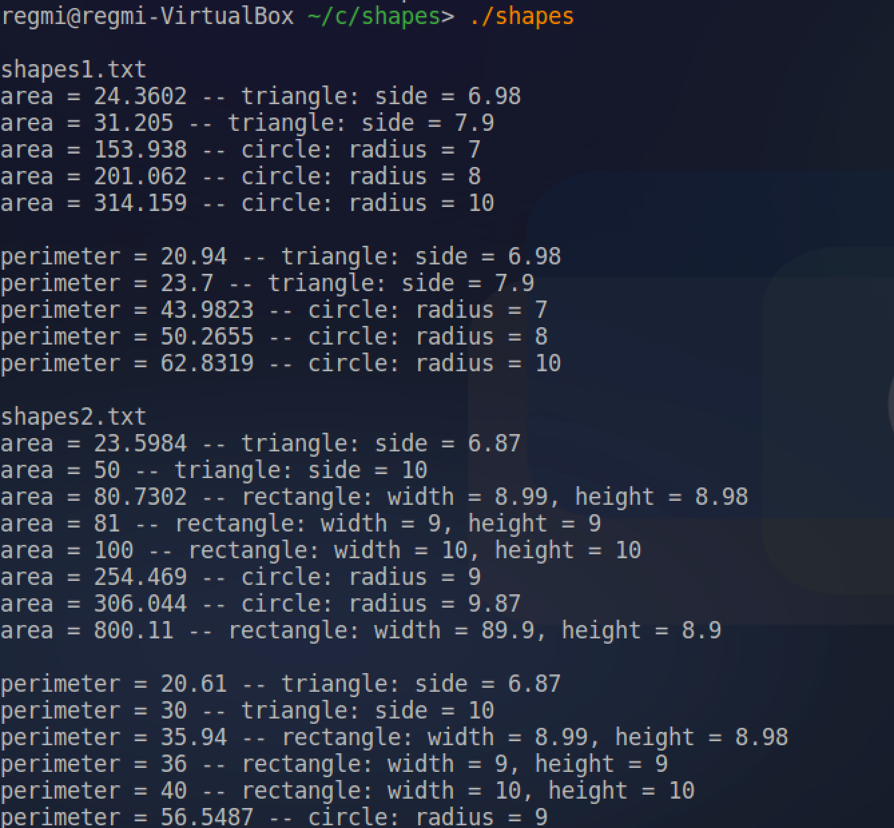
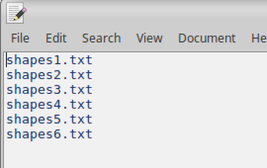
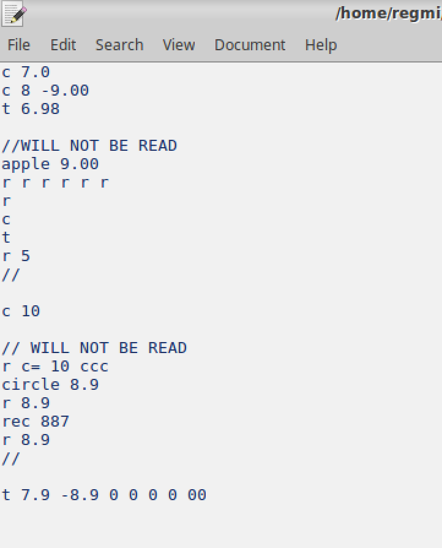

# shape-area

Calculates the area and perimeter/circumfrence of various shapes by reading data from text files - by utilizing file streams classes, inheritance and pointers. The program opens the text file "files.txt" to read the names of the specific text files that contain data of the shapes. The names of the text files must be on different lines and in the same directory as the project.

Specific files (such as "shapes1.txt" - as listed on "files.txt") are opened by the program and the area/perimeter/circumfrence are calculated. 

### Format recognized by the program is as follows:

- **Rectangle:** r sidelength_1_value sidelength_2_value
- **Square:** r sidelenght_value sidelength_value
- **Triangle:** t side_length_value
- **Circle:** c radius_value

Please note that all other invalid inputs are just ignored/skipped by the program. Currently only recognizes rectangles, squares, triangles and circles, further shape functionality may be updated later.

### Program Screenshots:

**Running the program:**

**Sample _files.txt_ file which contains a list of shape files to open and read:**

**Sample shape file. Please note that erranous entries are skipped by the program as the file is read:**

